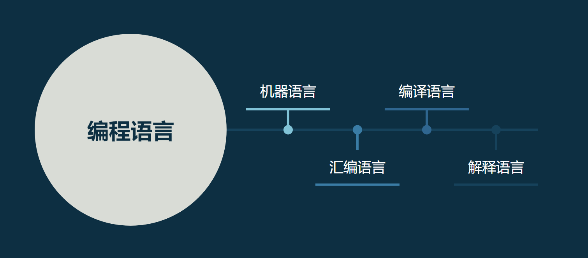
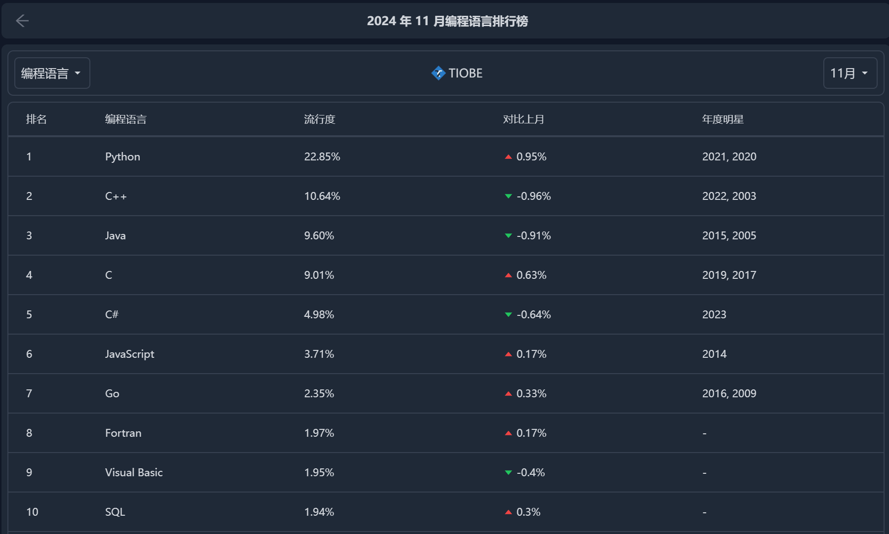

# 大学计算机基础-复习计划

## 引言

### 1.1 介绍

大学计算机基础是一门工具性的基础课程，就目前而言，难度不高。想在短期内获得较高的分数，较为容易。

大学计算机主要分为两部分，计算机系统基础以及python入门。其中Python熟练掌握基本语法即可。python被誉为最容易入门的编程语言之一，相信在努力下都能够，很快的掌握。

### 1.2 学习方法

...

### 1.3 注

本教程中标有*号的为仅需了解部分，便于增强对编程的了解。

## 编程语言初步*

### 2.1 定义

编程语言（programming language）可以简单的理解为一种计算机和人都能识别的[语言](https://baike.baidu.com/item/语言/72744?fromModule=lemma_inlink)。一种[计算机语言](https://baike.baidu.com/item/计算机语言/4456504?fromModule=lemma_inlink)让程序员能够准确地定义计算机所需要使用的数据，并精确地定义在不同情况下所应当采取的行动。 [1]

编程语言处在不断的发展和变化中，从最初的[机器语言](https://baike.baidu.com/item/机器语言/2019225?fromModule=lemma_inlink)发展到如今的2500种以上的[高级语言](https://baike.baidu.com/item/高级语言/299113?fromModule=lemma_inlink)，每种语言都有其特定的用途和不同的发展轨迹。编程语言并不像人类自然[语言发展](https://baike.baidu.com/item/语言发展/12650763?fromModule=lemma_inlink)变化一样的缓慢而又持久，其发展是相当快速的，这主要是计算机硬件、互联网和[IT](https://baike.baidu.com/item/IT/16684878?fromModule=lemma_inlink)业的发展促进了编程语言的发展。

### 2.2 发展历程



机器语言诞生于计算机出现之初，以01串的形式编写程序，晦涩难懂可读性差。于是逐渐诞生了用单词代替01串的汇编语言。在后文中我们学习的TOY计算机，就是一种简单的汇编语言范例。机器语言与汇编语言都可以做到直接对计算机硬件的操作，属于初级语言。学习成本高，代码长度长，效率较低，但性能开支较小。

编译型语言与解释型语言属于高级语言，在计算机发展过程中逐渐兴起，编译型语言，以C，C++，C#等为代表，通过预先编写的编译器将代码编译为机器语言。解释型语言以我们学习的Python，JavaScript,Perl等为代表，其显著特征为，代码简洁、入门较为简单，语法丰富，但运行效率较低，对底层的实现不够直观等。

### 2.3 Python

Python由[荷兰国家数学与计算机科学研究中心](https://baike.baidu.com/item/荷兰国家数学与计算机科学研究中心/53889845?fromModule=lemma_inlink)的[吉多·范罗苏姆](https://baike.baidu.com/item/吉多·范罗苏姆/328361?fromModule=lemma_inlink)于1990年代初设计，作为一门叫做[ABC语言](https://baike.baidu.com/item/ABC语言/334996?fromModule=lemma_inlink)的替代品。 [1]Python提供了高效的高级[数据结构](https://baike.baidu.com/item/数据结构/1450?fromModule=lemma_inlink)，还能简单有效地[面向对象](https://baike.baidu.com/item/面向对象/2262089?fromModule=lemma_inlink)编程。Python语法和动态类型，以及[解释型语言](https://baike.baidu.com/item/解释型语言/8888952?fromModule=lemma_inlink)的本质，使它成为多数平台上写脚本和快速开发应用的[编程语言](https://baike.baidu.com/item/编程语言/9845131?fromModule=lemma_inlink)， [2]随着版本的不断更新和语言新功能的添加，逐渐被用于独立的、大型项目的开发。

根据**「TIOBE 编程社区指数」**Python在近年居于最热门语言的位置。



进入AI时代，掌握一种编程语言作为工具日益不可或缺。Python作为AI时代重要的一种语言，学好它是非常重要的，不仅仅是为了应付考试。

## Python基础语法

### 3.1 文件*

Python的代码文件通常以`.py`作为后缀（文件扩展名），e.g. `my.py`

在命令提示行（CMD）中可以通过`python3 my.py`运行Python代码。

### 3.2 注释

Python中，以`#`作为单行注释的标志。以`'''注释内容'''`作为多行注释的标志。例如：

```python
# 第一个注释
# 第二个注释
 
'''
第三注释
第四注释
'''
 
print ("Hello, Python!")
```

以上代码的运行结果为

``````
Hello, Python!
``````

即，注释的内容并不会被执行。

### 3.3 行与缩进

python最具特色的就是使用缩进来表示代码块，不需要使用大括号 **{}** 。

缩进的空格数是可变的，但是同一个代码块的语句必须包含相同的缩进空格数（惯例使用四个空格，一个`Tab`）。实例如下：

```py
if True:
    print("True1") 
    print('True2')
else:    
    print("False")
```

代码中的`print("True1")` 、`print('True2')`就属于同一代码块。

以下代码最后一行语句缩进数的空格数不一致，会导致运行错误：

```python
if True:
  print("Answer")
  print("True")
else:
  print("Answer")
 print("False")   # 缩进空格数不一致，会导致运行错误
```

以上程序由于缩进不一致，执行后会出现类似以下错误：·

```python
 File "test.py", line 6
    print ("False")    # 缩进不一致，会导致运行错误
                                      ^
IndentationError: unindent does not match any outer indentation level
```

同时，代码缩进的错误也会带来代码的逻辑错误。

```python
if True:
  print("Answer")
  print("True")
else:
  print("Answer")
print("False")   # 缩进空格数不一致，会导致运行错误
```

以上程序由于缩进错误，导致逻辑错误，结果如下：

``````python
Answer
True
False
``````

违反了我们编写代码的初衷，是一类常见错误。

### 3.4 空行

函数之间或类的方法之间用空行分隔，表示一段新的代码的开始。类和函数入口之间也用一行空行分隔，以突出函数入口的开始。

空行与代码缩进不同，空行并不是 Python 语法的一部分。书写时不插入空行，Python 解释器运行也不会出错。但是空行的作用在于分隔两段不同功能或含义的代码，便于日后代码的维护或重构。

**记住：**空行也是程序代码的一部分，但不会对程序运行产生影响。

### 3.5 import 与 from...import

在 python 用 **import** 或者 **from...import** 来导入相应的模块。

将整个模块(`somemodule`)导入，格式为： `import somemodule`

从某个模块中导入某个函数,格式为： `from somemodule import somefunction`

从某个模块中导入多个函数,格式为： `from somemodule import firstfunc, secondfunc, thirdfunc`

将某个模块中的全部函数导入，格式为： `from somemodule import *`

辨析以下两个代码的区别：

```python
import sys
print('================Python import mode==========================')
print ('命令行参数为:')
for i in sys.argv:
    print (i)
print ('\n python 路径为',sys.path)
```

```python
from sys import argv,path  #  导入特定的成员
 
print('================python from import===================================')
print('path:',path) # 因为已经导入path成员，所以此处引用时不需要加sys.path
```

## Python变量

### 4.1 介绍

Python 中的变量不需要声明。每个变量在使用前都必须赋值，变量赋值以后该变量才会被创建。

在 Python 中，变量就是变量，它没有类型，我们所说的"类型"是变量所指的内存中对象的类型。

等号（=）用来给变量赋值。

等号（=）运算符左边是一个变量名,等号（=）运算符右边是存储在变量中的值。例如：

```python
counter = 100          # 整型变量
miles   = 1000.0       # 浮点型变量
name    = "runoob"     # 字符串

print(counter)
print(miles)
print(name)
```

运行结果：

```python
100
1000.0
runoob
```

> **注：**
>
> 1.标识符(例如**变量名**)
>
> - 第一个字符必须是字母表中字母或下划线 **_** 。
> - 标识符的其他的部分由字母、数字和下划线组成。
> - 标识符对大小写敏感。
>
> 在 Python 3 中，可以用中文作为变量名，非 ASCII 标识符也是允许的了。
>
> 2.保留字*
>
> 保留字即关键字，我们不能把它们用作任何标识符名称。Python 的标准库提供了一个 keyword 模块，可以输出当前版本的所有关键字：
>
> ```python
> >>> import keyword
> >>> keyword.kwlist
> ['False', 'None', 'True', 'and', 'as', 'assert', 'break', 'class', 'continue', 'def', 'del', 'elif', 'else', 'except', 'finally', 'for', 'from', 'global', 'if', 'import', 'in', 'is', 'lambda', 'nonlocal', 'not', 'or', 'pass', 'raise', 'return', 'try', 'while', 'with', 'yield']
> ```

### 4.2 赋值

Python允许你同时为**多个变量赋值**。例如：

```python
a = b = c = 1
```

以上实例，创建一个整型对象，值为 1，从后向前赋值，三个变量被赋予相同的数值。

您也可以为**多个对象指定多个变量**。例如：

```python
a, b, c = 1, 2, "runoob"
```

以上实例，两个整型对象 1 和 2 的分配给变量 a 和 b，字符串对象 "runoob" 分配给变量 c。

## Python标准数据类型

### 5.1 介绍

Python3 中常见的数据类型有：

- Number（数字）
- String（字符串）
- bool（布尔类型）
- List（列表）
- Tuple（元组）
- Set（集合）
- Dictionary（字典）

Python3 的六个标准数据类型中：

- **不可变数据（3 个）：**Number（数字）、String（字符串）、Tuple（元组）；
- **可变数据（3 个）：**List（列表）、Dictionary（字典）、Set（集合）。

此外还有一些高级的数据类型，如: 字节数组类型(bytes)。

### 5.2 基础知识学习指引

[Python3 基本数据类型 | 菜鸟教程](https://www.runoob.com/python3/python3-data-type.html)

[Python3 数据类型转换 | 菜鸟教程](https://www.runoob.com/python3/python3-type-conversion.html)

[Python3 数字(Number) | 菜鸟教程](https://www.runoob.com/python3/python3-number.html)

[Python3 字符串 | 菜鸟教程](https://www.runoob.com/python3/python3-string.html)

[Python3 列表 | 菜鸟教程](https://www.runoob.com/python3/python3-list.html)

[Python3 元组 | 菜鸟教程](https://www.runoob.com/python3/python3-tuple.html)*

[Python3 字典 | 菜鸟教程](https://www.runoob.com/python3/python3-dictionary.html)*

[Python3 集合 | 菜鸟教程](https://www.runoob.com/python3/python3-set.html)*

## Python 条件控制

参见[Python3 条件控制 | 菜鸟教程](https://www.runoob.com/python3/python3-conditional-statements.html)

## Python 循环语句

参见[Python3 循环语句 | 菜鸟教程](https://www.runoob.com/python3/python3-loop.html)

## Python 错误与异常

### 8.1 概论

错误与异常在编程中总和我们形影不离，因此正确的处理异常是我们不可或缺的一项技能。

Python作为一种高级语言，错误提示的可读性算是非常好的。有同学会说，“这错误提示就是一堆英文，我看不懂啊！”

要读懂错误提示，我们首先要弄清错误提示的结构。

```python
def test(my_input):
    print(my_input[5])

test(['1','2'])
```

错误如下：

```python
Traceback (most recent call last):
  File "C:/Users/xieao/AppData/Local/Programs/Python/Python311/test.py", line 4, in <module>
    test(['1','2'])
  File "C:/Users/xieao/AppData/Local/Programs/Python/Python311/test.py", line 2, in test
    print(my_input[5])
IndexError: list index out of range
```


红框部分的调用信息为我们寻找错误提供了溯源路径。

现在我们来仔细查看内容，每两行为一个小部分，第一行为文件路径，第二行是错误的具体代码。

例如`File "C:/Users/xieao/AppData/Local/Programs/Python/Python311/test.py", line 2, in test`表示在test.py中的test函数中的第2行出现问题。

`print(my_input[5])`则指出了错误的具体代码。

`IndexError: list index out of range`为错误消息。是我们最需要关注的部分。

其中`:`前的部分为错误类型，本例中为`IndexError`。`:`后的部分为具体错误提示，本例中为` list index out of range`

现在，有同学还会说，这不是从一段英文，变成一句英文吗。我还是看不懂啊！

OK，百度翻译，有道翻译，百度，必应，甚至Kimi、豆包、ChatGPT都是你很大的助力。推荐先用翻译软件，错误提示中常见的单词并不多，学会了，你就可以拿下大计了[doge]。

### 8.2 错误

在Python中主要指语法错误。下面列举常见的语法错误。

